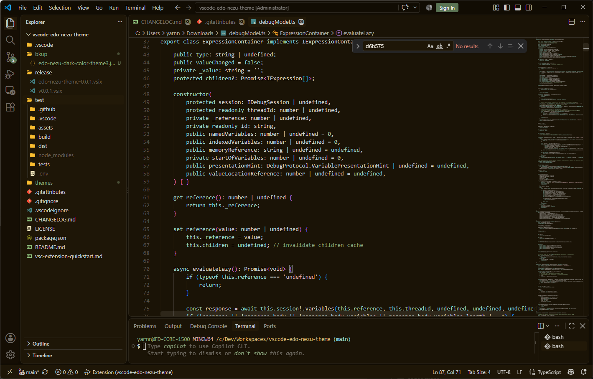

# Edo Nezu Themes

Visual Studio Code themes designed for long hours of comfortable development.

---

🌸 Japanese note  
日本の伝統色を使用して作成したカラーテーマです。目に優しく、長時間作業していても疲れない配色を目指しています。

---

## 💡 Concept

- **Easy on the eyes**: Harsh blue and high-glare hues are toned down.
- **Traditional Japanese colors**: Built upon muted, grayish tones (chosen from Edo-nezu and Japanese traditional colors).
- **Reduced brightness**: Avoids web-safe colors as well as pure white and black (`#FFFFFF` and `#000000`) to prevent harsh glare.
- **Minimal palette**: Carefully limited color count to reduce visual noise.
- **Functional contrast**: Preserves clear syntax hierarchy and practical readability.
- **Everyday comfort**: Designed not like flashy luxury wear, but like comfortable casual wear for daily work.

## 🎨 Themes

This extension is a work in progress (WIP) with colors still being actively tuned.  
A Light theme will be added in an upcoming release.

- **Edo Nezu Dark**
- **Edo Nezu Light** `[Planned]`

## 📷 Screenshot

### Edo Nezu Dark

## 📜 What is "Edo-Nezu"?

"Edo-nezu" (江戸鼠, meaning Edo grayish) is a traditional Japanese color characterized by warm brown or gray tones.

In the late 18th century (during the Edo period), the Tokugawa shogunate issued strict sumptuary laws prohibiting commoners from wearing vivid, opulent colors such as deep red and purple. Restricted to using only subdued tones like brown and gray, the townspeople of Edo exercised great ingenuity, creating hundreds of delicate and subtle shades. This aesthetic sensibility became known as "Shijūhatcha-hyakunezu" (四十八茶百鼠, meaning a vast variety of brown and gray colors), symbolizing the rich variety and nuance found within these colors.

Edo-Nezu gained immense popularity as a symbol of "_iki_" (粋) — a refined, understated style born from the ability to elevate strict constraints into a creative aesthetic.

## 🕒 Changelog

See [CHANGELOG.md](CHANGELOG.md) for detailed release notes and version history.

## ⚖️ License

This project is licensed under the [MIT License](LICENSE).  
Copyright (c) 2026 arukumo.

---

## ☕ Support

I would greatly appreciate your support in the form of a coffee.

