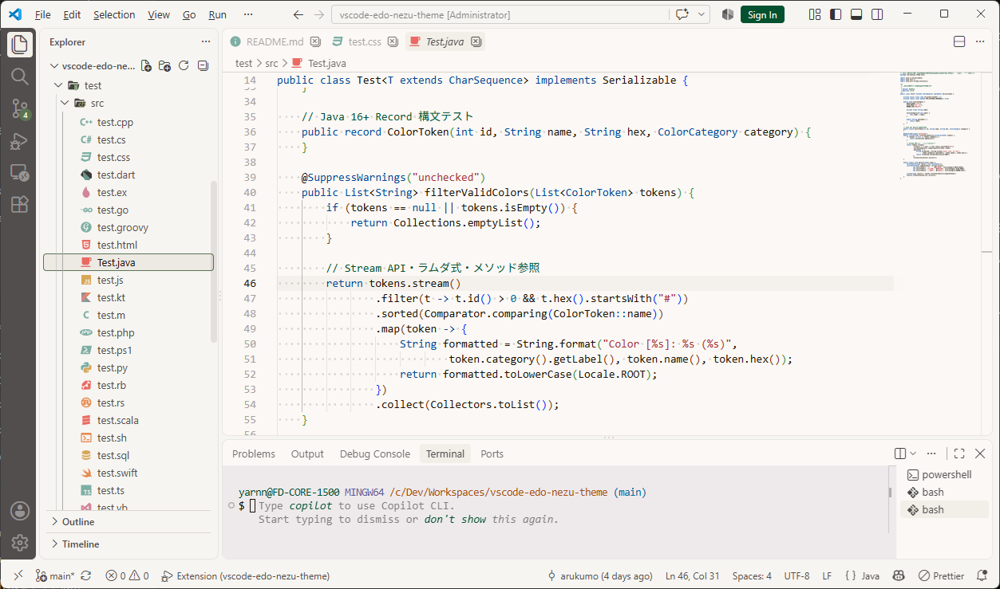

# Edo Nezu Themes

A chic, soothing, and eye-friendly color and icon theme for Visual Studio Code, using traditional Japanese colors.  
Designed with a well-balanced palette for readability and reduced glare to keep typing comfortable during long sessions.

---

🌸 Japanese note  
日本の伝統色を使用して作成したカラーテーマです。目に優しく、長時間作業していても疲れない配色を目指しています。

---

## Concept

- **Easy on the eyes**: Tones down harsh blue and high-glare hues.
- **Traditional Japanese colors**: Thoughtfully selected muted, grayish tones from Edo-nezu and Japanese traditional palettes.
- **Reduced brightness**: Avoids primary colors as well as pure white and black (`#FFFFFF`/`#000000`) to prevent harsh glare.
- **Minimal palette**: Curates a limited color count to reduce visual noise.
- **Functional contrast**: Preserves clear syntax hierarchy and practical readability.
- **Balanced visual depth**: Balances advancing and receding colors so keywords and syntax guide the eye without jumping out aggressively.
- **Everyday comfort**: Designed not like flashy luxury wear, but like comfortable casual wear for daily work.

## Themes Included

Color palettes and contrast balances are continually refined through daily coding use.

### Color Themes

- **Edo Nezu Dark**
- **Edo Nezu Light**

> 💡 Preview themes in your browser at [VS Code Themes](https://vscodethemes.com/?q=Edo+Nezu+Theme).

### File Icon Themes

- **Edo Nezu Icon Theme**
- **Edo Nezu Material Icon Theme**

## Screenshots

### Edo Nezu Dark & edo-nezu-icon-theme

_Inspired by chalkboards and chalk. Reduced blue tones, eye-friendly dark theme._


### Edo Nezu Light & edo-nezu-material-icon-theme

_Inspired by Japanese washi paper and sumi ink. A glare-free, highly readable light theme._



## Installation & Usage

### 1. Install Extension

Search for **Edo Nezu Theme** in the VS Code Extensions view (`Ctrl+Shift+X` / `Cmd+Shift+X`) and click **Install**.  
Or install from [Marketplace > Edo Nezu Theme](https://marketplace.visualstudio.com/items?itemName=arukumo.edo-nezu-theme).

### 2. Activate Themes

- **Color Theme**: Press `Ctrl+K Ctrl+T` (or `Cmd+K Cmd+T`) and select **Edo Nezu Dark** or **Edo Nezu Light**.
- **File Icon Theme**: Open the Command Palette (`Ctrl+Shift+P` / `Cmd+Shift+P` or `F1`), run **Preferences: File Icon Theme**, and select **Edo Nezu Icon Theme** or **Edo Nezu Material Icon Theme**.

Or configure manually in your user `settings.json` (or `.vscode/settings.json` in your workspace):

```json
// Edo Nezu Dark & edo-nezu-icon-theme
{
  "workbench.colorTheme": "Edo Nezu Dark",
  "workbench.iconTheme": "edo-nezu-icon-theme"
}

// Edo Nezu Light & edo-nezu-material-icon-theme
{
  "workbench.colorTheme": "Edo Nezu Light",
  "workbench.iconTheme": "edo-nezu-material-icon-theme"
}
```

## What is "Edo-Nezu"?

"Edo-nezu" (江戸鼠, meaning Edo grayish) is a traditional Japanese color characterized by warm brown or gray tones.

In the late 18th century (during the Edo period), the Tokugawa shogunate issued strict sumptuary laws prohibiting commoners from wearing vivid, opulent colors such as deep red and purple. Restricted to using only subdued tones like brown and gray, the townspeople of Edo exercised great ingenuity, creating hundreds of delicate and subtle shades. This aesthetic sensibility became known as "Shijūhatcha-hyakunezu" (四十八茶百鼠, meaning a vast variety of brown and gray colors), symbolizing the rich variety and nuance found within these colors.

Edo-Nezu gained immense popularity as a symbol of "_iki_" (粋) — a refined, understated style born from the ability to elevate strict constraints into a creative aesthetic.

## Changelog

See [CHANGELOG.md](CHANGELOG.md) for detailed release notes and version history.

## License

This project is licensed under the [MIT License](LICENSE).
Copyright (c) 2026 arukumo.

### Credits & Acknowledgments

- Icon assets are adapted from:
  - [Gruvbox Icon Theme](https://github.com/azat-io/vscode-gruvbox-icon-theme) by azat-io (MIT License)
  - [Gruvbox Material Icon Theme](https://github.com/Jonathan-Harty/vscode-material-icon-theme) by Jonathan Harty (MIT License)
  - [Material Icon Theme](https://github.com/PKief/vscode-material-icon-theme) by Philipp Kief (MIT License)

---

## Support

I would greatly appreciate your support in the form of a coffee.

<a href="https://www.buymeacoffee.com/arukumo"></a>
